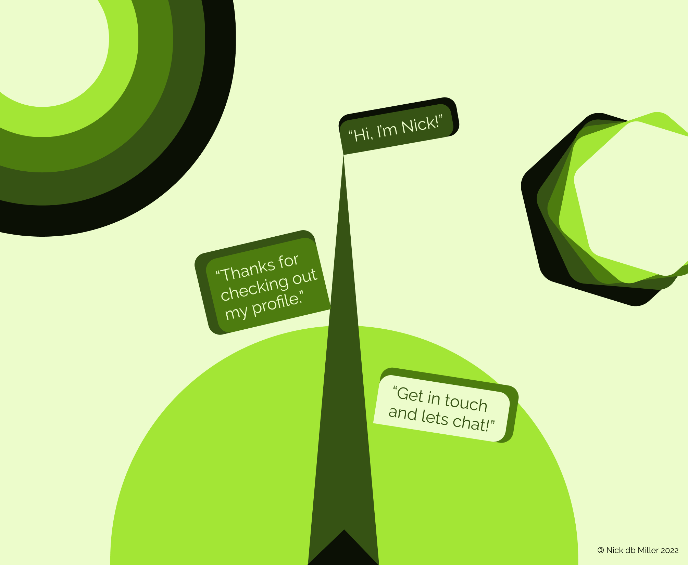

[](mailto:nickbarrettmiller@gmail.com)

## Welcome!
> As a full stack developer I am driven to simplify intricate problems. My background in systems level thinking enables me to see the sum of complex interactions. Solving tough challenges inspires me to pursue information with tenacity and confidence, and intuit creative ways to overcome obstacles.

## Currently open to work. Let's chat!
[](mailto:nickbarrettmiller@gmail.com)
[](https://www.linkedin.com/in/ndbmiller/)

## Click any badge to learn more about my stack!

### Languages I use:
[](https://developer.mozilla.org/en-US/docs/Glossary/HTML5)
[](https://developer.mozilla.org/en-US/docs/Web/CSS)
[](https://developer.mozilla.org/en-US/docs/Web/JavaScript)
[](https://www.ruby-lang.org/en/)

### Runtime of choice:
[](https://nodejs.org/en/about/)

### Libraries that drive my production:
[](https://reactjs.org/)
[](https://expressjs.com/)
[](https://reactrouter.com/)
[](https://jwt.io/)

[](https://rubyonrails.org/)

[](https://tailwindcss.com/)

### Databases I work with:
[](https://www.mongodb.com/)
[](https://www.postgresql.org/)

### Where I deploy my code:
[](https://www.heroku.com/about)
[](https://www.netlify.com/)

### Tools and utilities I love:
[](https://www.figma.com/)
[](https://fontawesome.com/)
[](https://www.npmjs.com/)
[](https://www.postman.com/)
[](https://prettier.io/)

[](https://github.com/nickdbmiller)
[](https://git-scm.com/)

### Where I bring my ideas to life:
[](https://code.visualstudio.com/)

### OS's I use:
[](https://en.wikipedia.org/wiki/Linux)
[](https://ubuntu.com/)
[](https://en.wikipedia.org/wiki/Microsoft_Windows)
[](https://en.wikipedia.org/wiki/MacOS)

## Some stats about me:
[](https://github.com/anuraghazra/github-readme-stats)

[](https://github.com/anuraghazra/github-readme-stats)

# Check me out on [](https://www.codewars.com/users/nickdbmiller)

## Here's some code I wrote recently!
### [Web of Rogues Game](https://nickdbmiller.github.io/Web-of-Rogues-Game/)
>These two functions are how objects are randomly rendered in Web of Rogues each time the dungeon is generated. First a list of floor tiles is generated...


```
let currentPlayerPos = null;
let currentStairPos = null;
let floorTiles = [];

function listFloorTiles () {
    for (let r = 1; r <= (dungeonHeight*dungeonWidth); r++) {
        let thisTile = document.getElementById(`-${r}`);
        if (thisTile.className == `floor`) {
            floorTiles.push(`-${r}`);
        };
    };
    return floorTiles;
};
```

>...Then the stairs are put on a random floor tile (using a RNG function declared elsewhere in the script). The tile will always be different than the floor tile the PC is put on to prevent overwriting.

```
function renderStairs () {
    let position = `${floorTiles[RNG(0, (floorTiles.length-1))]}`;
    let tile = document.getElementById(`${position}`);
    currentStairPos = position;
    if (currentPlayerPos == currentStairPos) {
        while (currentPlayerPos == currentStairPos) {
            position = `${floorTiles[RNG(0, (floorTiles.length-1))]}`;
            tile = document.getElementById(`${position}`);
            currentStairPos = position;
        }
        tile.innerText = `>`;
    } else {
        tile.innerText = `>`;
    };
};
```

## Thanks for stopping by! [](https://visitor-badge.glitch.me/#docs)

## Reach out to me about projects, problems, and coding!
[](mailto:nickbarrettmiller@gmail.com)
[](https://www.linkedin.com/in/ndbmiller/)

###### [Badges by Alexandre Sanlim.](https://github.com/alexandresanlim/Badges4-README.md-Profile)

###### [Visitor count badge project on glitch.](https://visitor-badge.glitch.me/)
